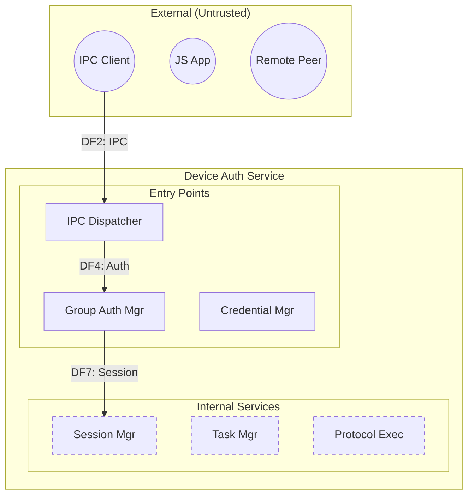

# STRIDE DFD Renderer Skill

## Purpose

Called by `stride-report-assembler` agent. Converts structured DFD YAML into an embedded Mermaid diagram suitable for HTML report inclusion.

**Core contract**: Faithfully render ALL elements from `dfd.yaml` into a complete Mermaid string. Do NOT filter, trim, or select a subset of nodes/edges.

## Invocation

Triggered by: `stride-report-assembler` agent

## DFD Element → Mermaid Mapping

| DFD Element | Mermaid Shape |
|-------------|--------------|
| Process (ENTRY_POINT) | Rounded rectangle: `P1(auth_service)` |
| Process (INTERNAL_ONLY) | Rounded rectangle with dashed border: `P7[Session Mgr]:::internal` |
| ExternalEntity | Rectangle with dashed border: `E1[Web Client]` |
| Store | Cylinder: `S1[(Database)]` |
| TrustBoundary | Colored subgraph: `subgraph TB1[Name]...end` |
| DataFlow | Arrow: `E1 -->|credentials| P1` |

## Rendering Rules (v0.3)

### Rule 1: Complete Rendering
- Iterate over ALL `external_entities`, ALL `processes`, ALL `stores`, ALL `data_flows`, ALL `trust_boundaries`
- Do NOT filter, do NOT select "main edges" only
- Do NOT use a hardcoded node whitelist
- Every `data_flow` with a valid `from` and `to` → rendered as an edge

### Rule 2: Large DFD Grouping
When total element count (nodes + edges) > 20:
- Group processes by functional layer:
  - **Entry Point Layer**: ENTRY_POINT processes (P1, P2, etc.)
  - **Internal Service Layer**: INTERNAL_ONLY processes (P7, P8, P9, P10, etc.)
  - **Crypto & Storage Layer**: Algorithm Loader, stores, key storage (P15, S1-S7, E4, E5)
- Use nested subgraphs with group labels

### Rule 3: Trust Boundary Styling
Color-code trust boundaries by zone:

| Zone | Color | Hex | Mermaid Style |
|------|-------|-----|---------------|
| Untrusted | Red | #f44336 | `style TB1 fill:#ffebee,stroke:#f44336` |
| DMZ | Orange | #ff9800 | `style TB2 fill:#fff3e0,stroke:#ff9800` |
| Trusted | Green | #4caf50 | `style TB3 fill:#e8f5e9,stroke:#4caf50` |

### Rule 4: Element Reachability Distinction
- ENTRY_POINT processes: solid border, default style
- INTERNAL_ONLY processes: dashed border `:::internal` class
- External entities outside trust boundary: use `E1(("label"))` circle notation

## Example Output

## Output

Returns a Mermaid diagram string ready for embedding in HTML `
...
`.

## Constraints

- Must handle partial DFDs (missing element types → render available elements with note)
- Must render ALL elements from the input YAML — no selection, no filtering
- Trust boundaries color-coded: red=untrusted, orange=DMZ, green=internal
- Large DFDs (>20 elements) → use subgraph grouping
- Output is a plain Mermaid string; HTML embedding is the html-reporter's responsibility
